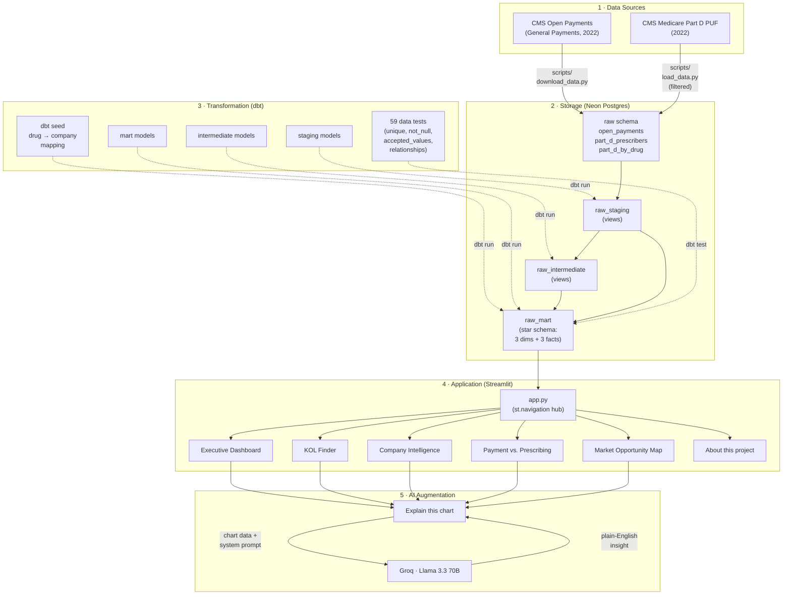
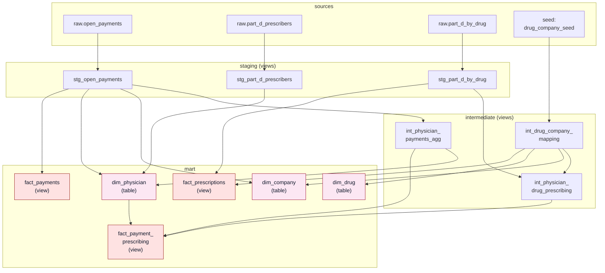
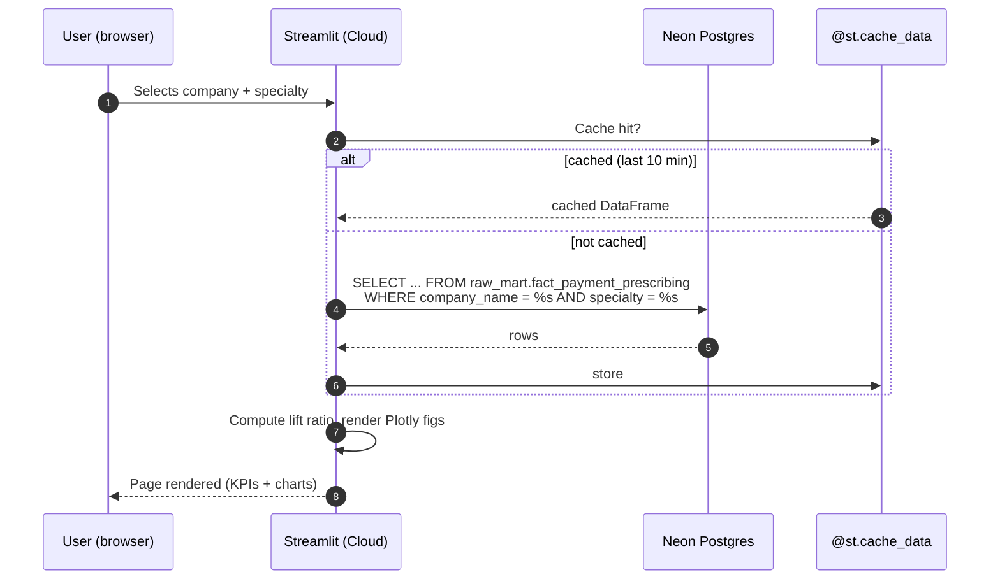
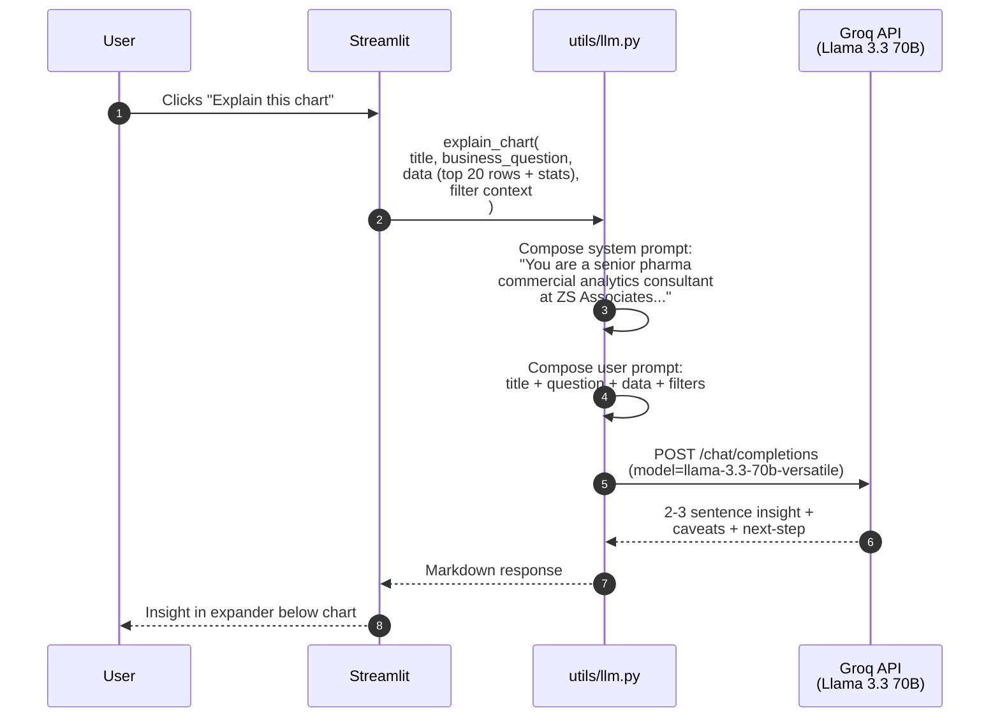

# Architecture

How the *Physician × Pharma Commercial Analytics* platform is put
together — read this if you want to understand the system before
diving into the code.

All diagrams below are Mermaid; GitHub renders them inline.

---

## 1. System overview

Five layers, each with a clearly bounded job. Anyone clicking around the
deployed Streamlit app touches every layer in a single request — but
the layers are independently testable.

**Why this shape:** the **dbt mart** is the contract between the data
team (everything left of it) and the application team (everything right
of it). The Streamlit app does not know — and does not need to know —
that raw CMS CSVs ever existed.

---

## 2. Data pipeline (CSV → mart)

The same data flows top-to-bottom on every full rebuild. The mart is
the only layer the Streamlit app ever touches at query time.

```mermaid
flowchart LR
    A["CMS.gov<br/>CSV downloads<br/>(~5 GB)"]
    B["data/raw/<br/>(local disk,<br/>gitignored)"]
    C["raw schema<br/>(filtered:<br/>top 10 mfrs,<br/>≥ $50, top<br/>specialties,<br/>tracked drugs)"]
    D["raw_staging<br/>(views — clean,<br/>type-cast, canonicalize)"]
    E["raw_intermediate<br/>(views — business<br/>logic, joins)"]
    F["raw_mart<br/>(tables + views —<br/>star schema)"]
    G["Streamlit app"]

    A -->|"download_data.py"| B
    B -->|"load_data.py<br/>(stream + filter)"| C
    C -->|"dbt run"| D
    D -->|"dbt run"| E
    E -->|"dbt run"| F
    F -->|"SELECT"| G

    style A fill:#E0E7FF,stroke:#1E3A8A,color:#0F172A
    style B fill:#FEF3C7,stroke:#92400E,color:#0F172A
    style C fill:#DBEAFE,stroke:#1E40AF,color:#0F172A
    style D fill:#D1FAE5,stroke:#065F46,color:#0F172A
    style E fill:#D1FAE5,stroke:#065F46,color:#0F172A
    style F fill:#FCE7F3,stroke:#9F1239,color:#0F172A
    style G fill:#F3E8FF,stroke:#6D28D9,color:#0F172A
```

**Free-tier discipline:** the load script filters aggressively *before*
inserting into Neon (top 10 manufacturers + payments ≥ $50 +
top-prescribing specialties only) — that's how we stay under the 512 MB
storage cap while preserving the headline analyses.

---

## 3. dbt model lineage

Twelve models, organized in three layers. dbt builds them bottom-up
based on `ref()` calls. Dashed lines are FK relationships that the
schema tests enforce.

**Why dims are tables and facts are views:** the dims are tiny and
joined to often, so we materialize. The facts have many rows but
mostly pass-through logic, so views keep us under Neon's storage cap.
`fact_payment_prescribing` is a full-outer-join of two intermediates —
a *table* would be ~150 MB; a *view* recomputes in ~3 sec on demand
and Streamlit caches for 10 minutes. The right trade-off for free-tier
infra.

---

## 4. User interaction flow (per page load)

What happens when a user picks a filter and hits *Apply*. Each step
is independently logged in Streamlit's runtime.

**Caching matters because Neon's free-tier compute auto-suspends after
5 minutes of inactivity, and the first query after a suspend takes
~10 sec to wake the warehouse.** With the 10-minute query cache, most
clicks return instantly from local memory.

---

## 5. "Explain this chart" LLM flow

Every chart has an *Explain this chart* button. Clicking it sends the
chart's underlying data plus a domain-aware system prompt to Groq.

**Why this design:**

- The system prompt sets the **persona** (pharma analyst at ZS) so the
  LLM's vocabulary matches the audience.
- We send only **summarized data** (top 20 rows + describe() stats), not
  the full dataset — keeps the prompt under ~2K tokens and the cost
  near-zero on Groq's free tier.
- Hard rules in the system prompt forbid causal claims, made-up numbers,
  and moralizing — so insights stay analytical, not journalistic.

---

## Where each piece lives

| Concern | Code location |
|---|---|
| Data download / load | `scripts/download_data.py`, `scripts/load_data.py` |
| Filter parameters | `scripts/config.py` |
| dbt models | `dbt_project/models/{staging,intermediate,mart}/` |
| Data quality tests | `dbt_project/models/**/_schema.yml` |
| Drug-company mapping | `dbt_project/seeds/drug_company_seed.csv` |
| Streamlit entry | `streamlit_app/app.py` (navigation hub) |
| Six views | `streamlit_app/views/*.py` |
| Shared UI components | `streamlit_app/utils/styles.py` |
| Database access | `streamlit_app/utils/db.py` |
| LLM integration | `streamlit_app/utils/llm.py` |
| Chart helpers | `streamlit_app/utils/charts.py` |
| CI | `.github/workflows/ci.yml` |
| Pre-commit hooks | `.pre-commit-config.yaml` |
