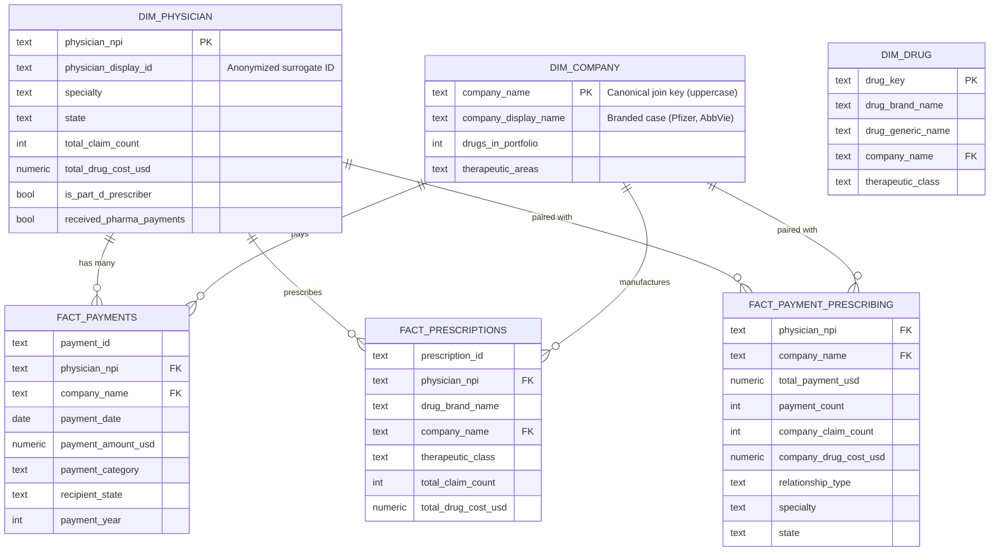
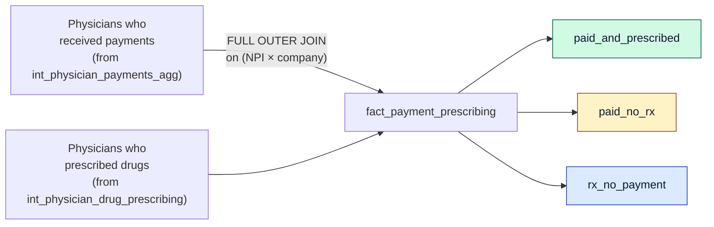
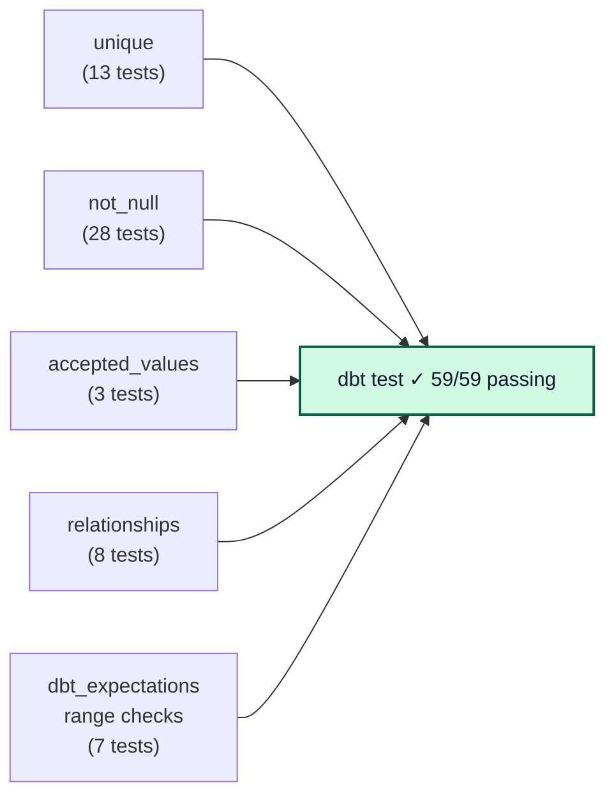
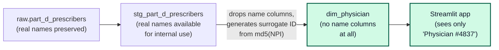

# Data Model

The mart is a classic Kimball-style star schema: a few small dimension
tables surrounded by a handful of fact tables that hold the measures.
This is the only layer the Streamlit app queries.

---

## Star schema

Three dimension tables (orange) and three fact tables (red). Lines are
foreign-key relationships.



---

## What each table is for

### Dimensions

| Table | Grain | Purpose |
|---|---|---|
| `dim_physician` | 1 row per NPI | Who the physician is — specialty, state, surrogate display ID, Part D activity. Built from the UNION of Part D prescribers and Open Payments recipients so referential integrity holds for both |
| `dim_company` | 1 row per pharma company | What we know about the manufacturer — canonical name (for joins) + display name (for the UI), drug portfolio size, therapeutic areas |
| `dim_drug` | 1 row per (brand × manufacturer) | Brand and generic names, therapeutic class. Co-marketed drugs (e.g. Eliquis = Pfizer + BMS) appear once per partner |

### Facts

| Table | Grain | Used by |
|---|---|---|
| `fact_payments` | 1 row per Open Payments transaction | Executive Dashboard, Company Intelligence, Market Opportunity Map |
| `fact_prescriptions` | 1 row per (physician × drug) | KOL Finder, Market Opportunity Map |
| `fact_payment_prescribing` | 1 row per (physician × company) — **paired view of payments AND prescribing** | Payment vs. Prescribing (the headline analytical view) |

---

## The headline analytical join

This is the join that powers the *Payment vs. Prescribing* view —
the question every pharma commercial team analyzes. It's a
`FULL OUTER JOIN` so we capture all three populations:



The `relationship_type` column tells you which bucket each row falls
into — useful for the lift-ratio analysis (paid prescribe more than
unpaid, within specialty).

---

## Data quality enforcement

Every dim and fact has tests in its `_schema.yml`. The dbt test run
executes 59 assertions on every build:



Examples:

- `dim_physician.physician_npi` must be **unique and not null**
- `fact_payments.company_name` must have a `relationships` match in
  `dim_company.company_name`
- `stg_open_payments.payment_category` must be in the **accepted-values**
  enum (Speaking Fee, Consulting Fee, Food and Beverage, etc.)
- `stg_open_payments.payment_amount_usd` must be `between 1 and 100,000,000`
  (range check from dbt_expectations)

---

## Privacy design

The mart layer intentionally **does not** include physician first or
last names — they're available in the staging layer for join purposes
but never propagate forward.



The surrogate is deterministic — same NPI always maps to the same
display ID across pages — but the ID cannot be reversed to a real
person. This matches the "research-grade presentation" pattern used
in academic publications on Open Payments data.

See `METHODOLOGY.md` § 0 for the full privacy rationale.

---

## Building it yourself

```bash
cd dbt_project
dbt deps                   # one-time: pull dbt-utils + dbt-expectations
dbt seed --profiles-dir .  # load drug→company seed
dbt run --profiles-dir .   # build all 12 models in dependency order
dbt test --profiles-dir .  # run all 59 data-quality tests
dbt docs generate          # generate the interactive lineage site
dbt docs serve             # open it in your browser at localhost:8080
```

The `dbt docs serve` command opens a fully-interactive version of
everything in this document — column descriptions, test results,
lineage clickable, compiled SQL for every model.
